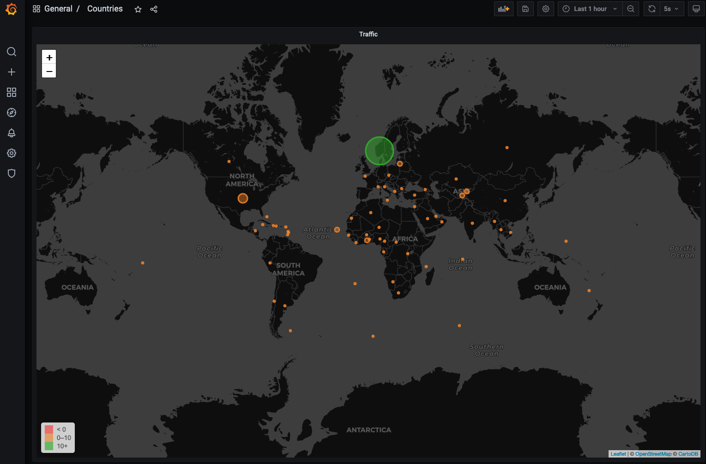

# data-visualizing

```bash
docker-compose up -d
```

Example data generated from National Oceanic and Atmospheric Administration’s (NOAA) Center for Operational Oceanographic Products and Services. See [influxdata](https://docs.influxdata.com/influxdb/v1.8/query_language/sample-data) documentation.

Go to ```http://localhost:3000``` to view example Grafana dashboard.

## InfluxDB

```SQL
> create database globalmap
> use globalmap
> INSERT test_country,country_code=US value=1
> SELECT * FROM "test_country"
name: test_country
time                country_code value
----                ------------ -----
1620484211870645277 US           1
> SELECT * FROM "test_country"^C
> INSERT test_country,country_code=NO value=1
> SELECT * FROM "test_country"
name: test_country
time                country_code value
----                ------------ -----
1620484211870645277 US           1
1620484410599741637 NO           1
```


